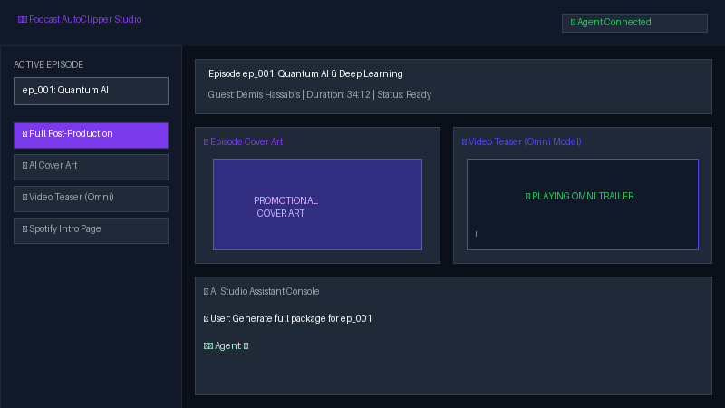

# 🎙️ Podcast AutoClipper Studio

> **An AI-powered podcast post-production web studio that transforms raw audio into publishable packages—show notes, timestamps, guest profiles, AI cover art, Omni video trailers, script timeline locators, and RSS distribution feeds.**



---

## 🚀 Overview

**Podcast AutoClipper** is an end-to-end podcast post-production automation agent built with the **Google Agent Development Kit (ADK)** and deployed on **Google Cloud Agent Platform** with a modern **Web Studio Dashboard**.

Podcast creators spend hours manually drafting show notes, timestamping key moments, creating video teasers, and generating promotional graphics. Podcast AutoClipper automates the entire workflow from a single web studio dashboard:

- 🎛️ **Episode Manager**: Easily **add**, **edit** (episode name & featured guest), and **delete** episodes with full state persistence.
- 💬 **Per-Episode Persistent Conversations**: Saves full chat logs and history independently for each episode in browser storage, allowing seamless context switching between episode sessions.
- 📜 **Script & Timestamp Timeline Locator**: Upload transcript/script files (`.srt`, `.vtt`, `.json`, `.txt`, `.csv`) or load sample scripts. Parses timestamped segments so video and audio editors can instantly locate best moments for video and audio clipping.
- 🎨 **Instant Web Cover Art & Cache-Busting**: Generates high-resolution square cover art images and instantly renders/updates them on the web dashboard with direct download support.
- 🎬 **Omni Video Teaser Trailers**: Produces promotional video teasers using Google's **Omni Model** (`gemini-omni-flash-preview`) and embeds them in a live video player.
- 📱 **Dedicated Live Workspace Panels**: 6 ordered live panels corresponding to each core function (Cover Art, Video Trailer, Spotify Notes, Audio Snippets, RSS Feed, Full Package) with glowing visual update indicators.
- 💡 **Suggested Prompt Tips**: Left panel prompt suggestions that populate structured templates into the chat input field without auto-submitting, giving users full review control before sending.
- 🎵 **Spotify Intro Pages & RSS Feeds**: Generates Spotify-formatted show notes and exports RSS 2.0 distribution XML.

---

## ✨ Key Features

1. **Script & Timestamp Timeline Locator**:
   - Upload transcript files in **.SRT**, **.VTT**, **.JSON**, **.TXT**, or **.CSV** formats.
   - Parses timeline timestamps (e.g. `[02:15 - 05:45]`) and highlights key podcast moments.
   - Includes one-click `✂️ Cut Audio` and `🎬 Cut Video` locator buttons that populate the trimmer prompt for instant clip extraction.
2. **Episode Management Panel**:
   - Add new episodes with custom IDs, titles, guest names, and durations.
   - Edit episode metadata on the fly or delete completed episodes.
3. **Per-Episode Persistent Session Storage**:
   - Independent chat logs automatically saved per episode, making tracking past AI outputs effortless.
4. **6 Dedicated Live Update Panels**:
   - Real-time updates with glowing visual badges (`✓ Updated Live`) as soon as the agent completes work:
     1. **AI Cover Art** (Image render + Download button)
     2. **Video Trailer** (Omni video player)
     3. **Spotify Intro & Show Notes** (Formatted notes + `.txt` file link)
     4. **Audio Snippet Trimmer** (Waveform player + MP3 download)
     5. **RSS Distribution Feed** (XML URL + Open feed link)
     6. **Full Package Overview** (Executive post-production breakdown)
5. **AI Visual & Video Studio**:
   - Integrated image generation for artwork and video trailer synthesis via `gemini-omni-flash-preview`.
6. **Cross-Session Memory Bank**:
   - Persists host brand tone, recurring sponsors, and episode structure preferences across sessions using Vertex AI Memory Bank.
7. **Grounding Knowledge Retrieval (RAG)**:
   - Grounded on `podcast_playbook.txt` via Vertex AI RAG Engine for strict editorial standards.

---

## ☁️ Google Cloud Tools & Architecture

| Google Cloud Service | Purpose in Podcast AutoClipper |
| :--- | :--- |
| **Vertex AI Memory Bank** | Persists host preferences, tone of voice, and brand guidelines across user sessions. |
| **Google GenAI / Omni Model (`gemini-omni-flash-preview`)** | Generates short video teaser trailers for podcast episodes in the global region. |
| **Imagen / Gemini Image Gen** | Generates custom 1:1 square cover art graphics for each episode. |
| **Vertex AI RAG Engine** | Grounding corpus built from `podcast_playbook.txt` for editorial guidelines. |
| **Cloud Storage (GCS)** | Public storage bucket hosting generated cover art, audio clips, RSS feeds, and teaser video MP4s. |
| **Firestore** | NoSQL database storing episode state, metadata, and generated asset links (`podcast_episodes` collection). |
| **A2UI (Agent-to-User Interface)** | Protocol for rendering rich visual card surfaces in the UI. |
| **Agent Runtime / Reasoning Engine** | Managed, scalable backend hosting the ADK A2A agent runtime. |
| **Cloud Run** | Serverless platform running the FastAPI proxy frontend and Web Studio Dashboard. |

---

## 🛠️ Project Structure

```
podcast-autoclipper/
├── app/
│   ├── agent.py               # Core ADK agent, tools, memory callback, & A2UI prompt
│   └── __init__.py
├── frontend/
│   ├── main.py                # FastAPI proxy connecting browser to deployed A2A agent
│   ├── static/
│   │   └── index.html         # Web Studio Dashboard with Timeline Locator & Live Panels
│   └── requirements.txt
├── scripts/
│   └── generate_demo_gif.py   # Script generating the animated demo GIF
├── podcast_playbook.txt       # RAG knowledge source for podcast editorial guidelines
├── demo.gif                   # Looping video preview of the Web Studio Dashboard
├── agents-cli-manifest.yaml   # Deployment metadata configuration
└── README.md                  # Project documentation
```

---

## 🏁 Getting Started

### 1. Prerequisites
Ensure you have the Google Cloud SDK and Python 3.11+ installed:
```bash
gcloud auth login
gcloud auth application-default login
gcloud config set project YOUR_PROJECT_ID
```

### 2. Local Environment Setup
```bash
git clone https://github.com/WeichengLite/buildwithgemini-podcast-autoclipper.git
cd buildwithgemini-podcast-autoclipper
python3 -m venv .venv
source .venv/bin/activate
pip install -r requirements.txt
```

### 3. Running the Web Studio Dashboard Locally
```bash
cd frontend
pip install -r requirements.txt
export AGENT_ENGINE_RESOURCE_NAME="projects/YOUR_PROJECT/locations/us-east1/reasoningEngines/YOUR_ENGINE_ID"
export AGENT_DIRECTORY="app"
python main.py
```
Open [http://localhost:8080](http://localhost:8080) in your browser to access the Web Studio Dashboard.

### 4. Deploying to Cloud
- **Agent Backend**:
  ```bash
  agents-cli deploy --project YOUR_PROJECT_ID --region us-east1
  ```
- **Frontend Service**:
  ```bash
  cd frontend
  gcloud run deploy podcast-autoclipper-frontend \
    --source . \
    --region us-east1 \
    --allow-unauthenticated \
    --set-env-vars AGENT_ENGINE_RESOURCE_NAME="...",AGENT_DIRECTORY="app"
  ```

---

## 📜 License
Licensed under the Apache 2.0 License.
